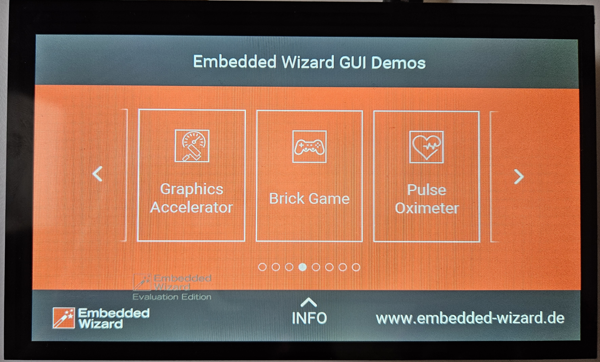

# ESP32-P4 Demo - Embedded Wizard

This repository contains a demo application showcasing the powerful combination of Espressif's ESP32-P4 microcontroller and TARA Systems' Embedded Wizard GUI framework.

## Demo Video

*Click the image above to watch the demo video*

## Technology Combination

This demo demonstrates the synergy between two cutting-edge technologies:

### ESP32-P4 Microcontroller
- **High Performance**: 400 MHz dual-core RISC-V processor
- **Graphics Capabilities**: Hardware-accelerated 2D graphics with support for up to 1024x600 displays
- **Memory**: PSRAM support for complex UI applications
- **Connectivity**: Provided by ESP32-C6 on the board
- **Optimized for UI**: Dedicated graphics processing unit and display controller

### Embedded Wizard GUI Framework
- **Professional UI Development**: Industry-grade framework for creating sophisticated user interfaces
- **Visual Design Tools**: WYSIWYG editor for rapid prototyping and development
- **Object-Oriented Architecture**: Clean, maintainable code generation
- **Multi-Platform Support**: Generate code for various embedded targets
- **Rich Graphics**: Support for animations, effects, and complex visual elements

## Key Features

- High-resolution display support (1024x600)
- Smooth animations and transitions
- Touch input handling
- Efficient memory management with PSRAM utilization
- Professional-grade UI components
- Real-time performance optimization

## Getting Started

For detailed information about developing UI applications for the ESP32-P4, refer to:

- **Tutorial Article**: [How to Easily Develop UI Applications for the ESP32-P4](https://developer.espressif.com/blog/2025/04/how-to-easily-develop-ui-applications-for-the-esp32-p4/)
- **Official Documentation**: [Getting Started with ESP32-P4-Function-EV-Board](https://doc.embedded-wizard.de/getting-started-esp32?v=14.00)
- **Espressif Developer Portal**: [Embedded Wizard Resources](https://developer.espressif.com/tags/embedded-wizard/)

## Hardware Requirements

- ESP32-P4-Function-EV-Board
- Compatible display (up to 1024x600 resolution)
- Power supply and connection cables

## About the Technologies

This demo showcases how the ESP32-P4's powerful graphics capabilities can be leveraged through the Embedded Wizard framework to create professional, responsive user interfaces for embedded applications. The combination enables developers to build sophisticated IoT devices with desktop-quality user experiences.

